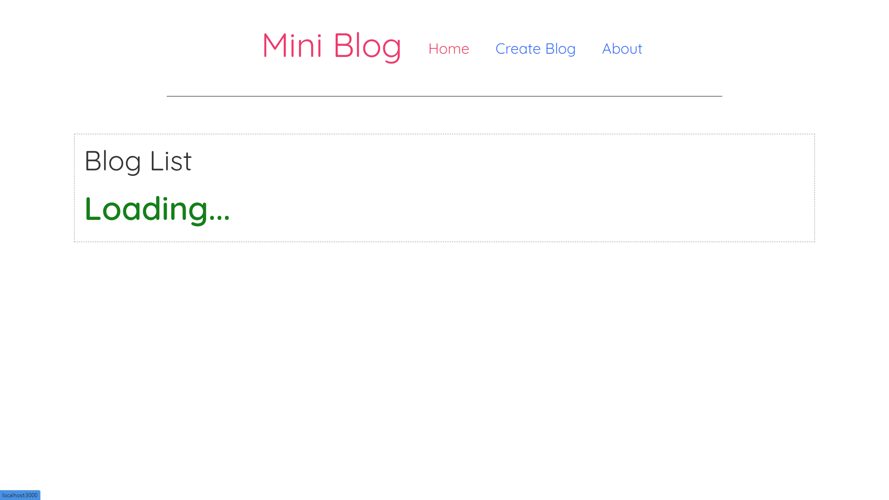
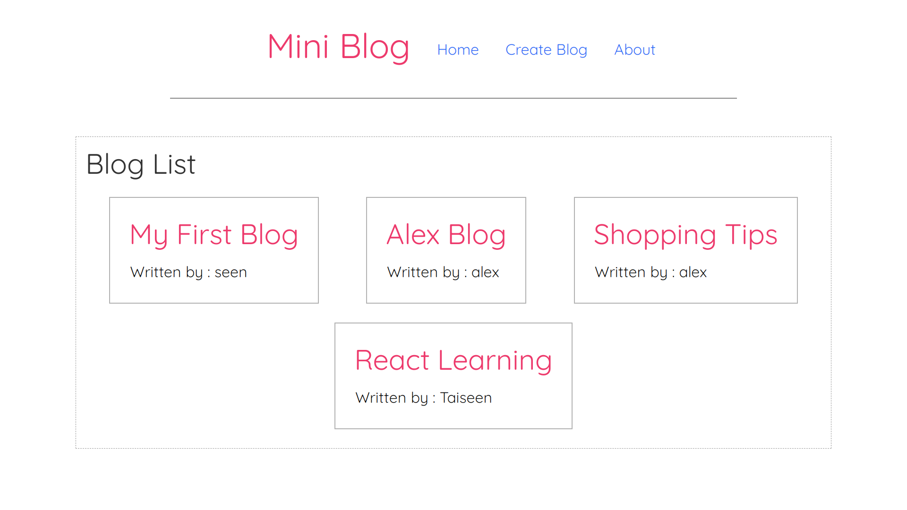
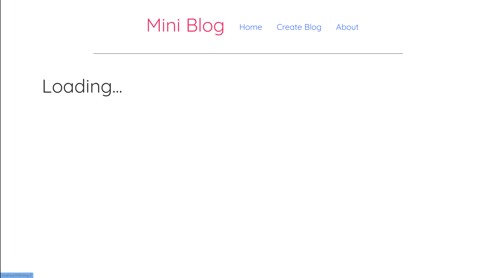
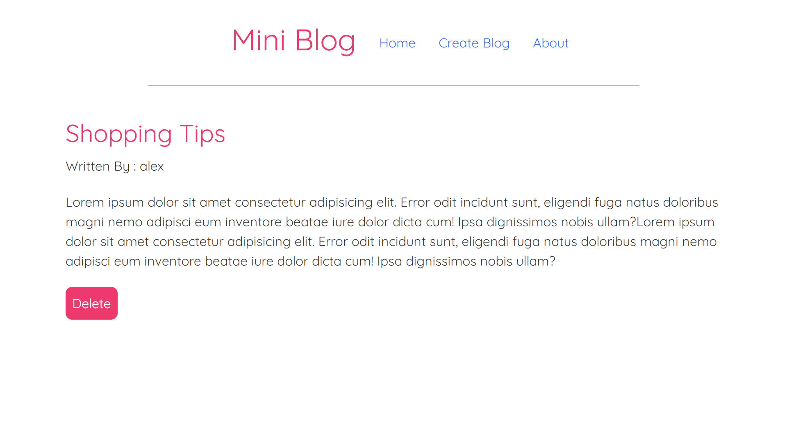
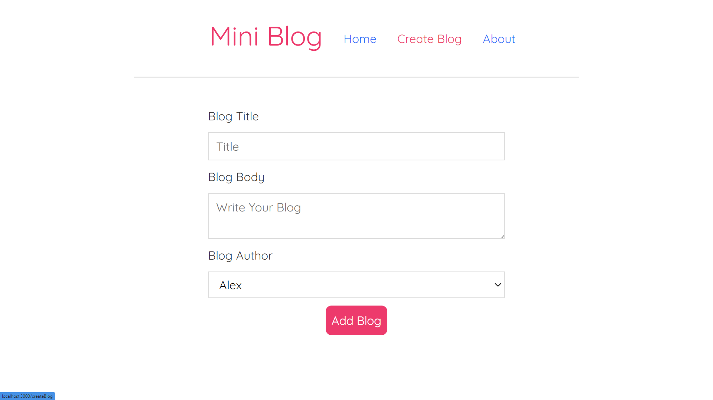
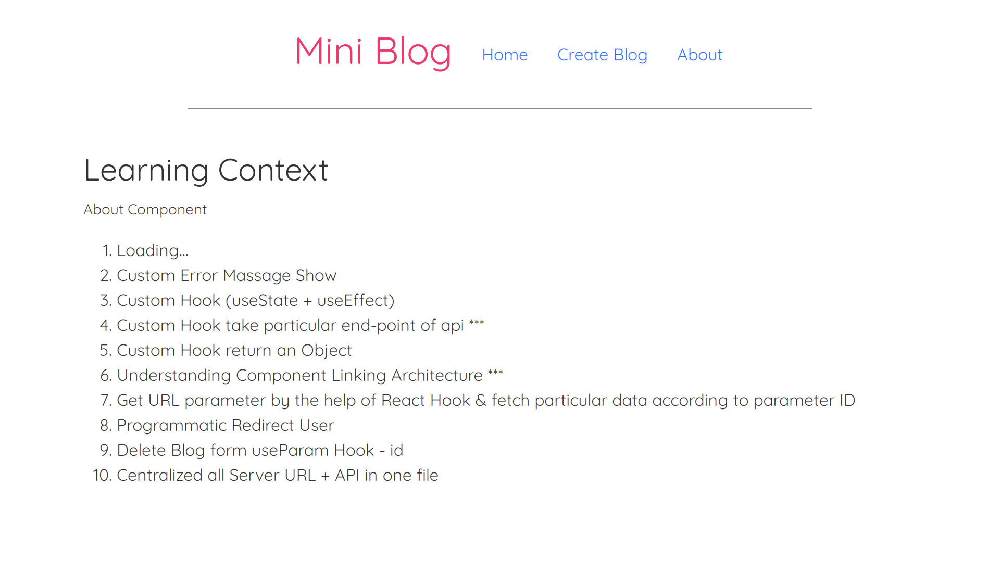

# Mini Blog Site | Small Project | React App

<!-- <|> [Live Link](https://.app) -->

## Concept Implementation
* Parent Child Component                
* Object Destructuring
* Implement -> useState & useEffect with dependency
* React input form
* Loading Logic
* Error Logic
* use Custom Hook for fetching data...

## Json Server | Locally Serve Data
* npm install -g json-server
* npx json-server --watch ./src/db/db.json --port 8000

## Mini Blog | Project Images

